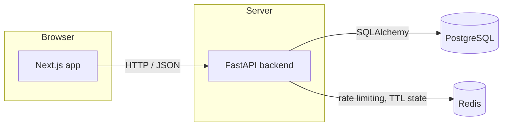
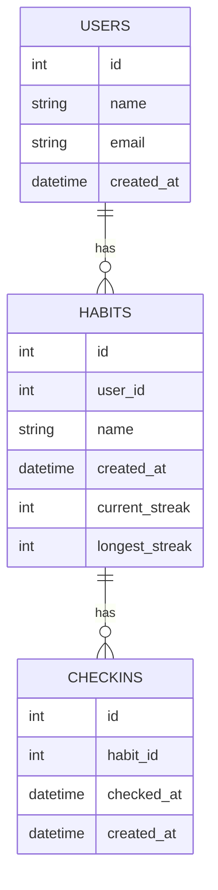

# Habit Tracker

This repo is the starting point for a coding interview at Focus Tiger. If you're a candidate, see [Preparing for the interview](#preparing-for-the-interview) below.

A small habit-tracking app. Users have habits, and check in on them day to day to build up a streak.

## Tech stack

- **Backend:** FastAPI (Python), SQLAlchemy, Alembic for migrations
- **Database:** PostgreSQL
- **Cache / short-lived state:** Redis
- **Frontend:** Next.js (App Router) with TypeScript and Tailwind CSS

## Getting started

Everything runs through Docker Compose, no local Python or Node install required.

```bash
docker compose up
```

Then open [http://localhost:3000](http://localhost:3000).

The database is seeded automatically with a demo user and a handful of habits the first time it starts up. The backend API runs at [http://localhost:8000](http://localhost:8000).

## Architecture



## Data model



## Preparing for the interview

Before the interview, please:

1. Clone this repo.
2. Run `docker compose up` and confirm it comes up cleanly, the frontend loads at [http://localhost:3000](http://localhost:3000) and shows seeded habits.

That's the only preparation needed, there's no need to read through the whole codebase or design anything in advance. During the interview, we'll build new features together on top of what's here.

Bring whatever AI coding tools you're most comfortable with. You're expected and encouraged to use them throughout, we're interested in how you work with AI on an existing codebase, not in unassisted typing.
